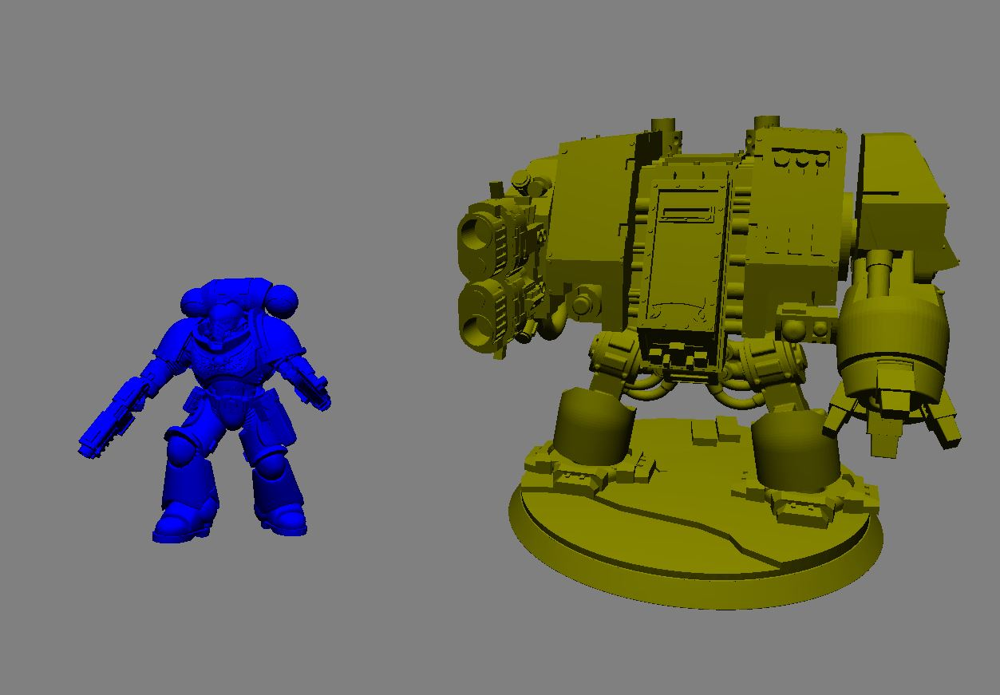

# OpenGL STL Renderer

A lightweight desktop 3D rendering application built for Windows with **C++**, **SDL3**, and **OpenGL**. The application provides an interactive environment for loading and visualizing multiple STL models simultaneously. This project was built in my free time and is far from polished or completed.




## Technologies

- C++17
- SDL3
- OpenGL
- GLAD
- Windows API (for file browsing)


# Getting Started

To get started install the required software to your machine and follow the steps below.

## Requirements

- Windows OS
- GCC compiler with make
- OpenGL 3.3+


## Building

Clone the repository:

```bash
git clone https://github.com/dlorbek/3D-renderer-gpu.git
cd 3D-renderer-gpu
```

First compile the resources needed for app icon:

```bash
make resources
```

Then compile the project using GCC and make as shown:

```bash
make all
```
Or if you do not want a console window to open:

```bash
make nocmd
```

---

## Usage

Launch the application:

```bash
main.exe
```
Or
```bash
3D-Viewer.exe
```

### Loading Models

1. Press O.
2. Browse to an STL file.
3. Select the model.
4. The model will appear in the scene.

Multiple models can be loaded into the same scene.

---

### Manipulating Models

After selecting a model you can:

- Move
- Rotate
- Scale

Each transformation affects only the currently selected object.

---

### Controls

| Action | Description |
|---------|-------------|
| Left Click | Select Model |
| Left Mouse Button + Drag | Rotate Model |
| Mouse Wheel | Scale Model |
| Right Mouse Button + Drag | Move Model |


## Project Structure

```text
.
├── data/
│    └── images/
│    └── shaders/
│    └── icon.ico
├── include/
│    └── glad/
│    └── headers/
│    └── KHR/
│    └── SDL3/
│    └── SDL3_image/
├── lib/
│   ├── cmake/
│   │     └── SDL3
│   │     └── SDL3_image
│   └── pkgconfig/
├── src/
├── .gitignore
├── Makefile
├── README.md
├── resources.rc
├── SDL3.dll

```


## Acknowledgements

The shader loading helper class was copied from the following open-source project:

- **opengl-tutorials** – https://github.com/VictorGordan/opengl-tutorials

Please refer to the original repository for additional details and licensing information.


